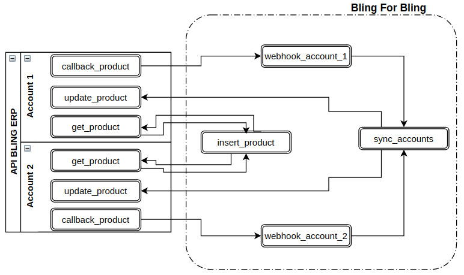
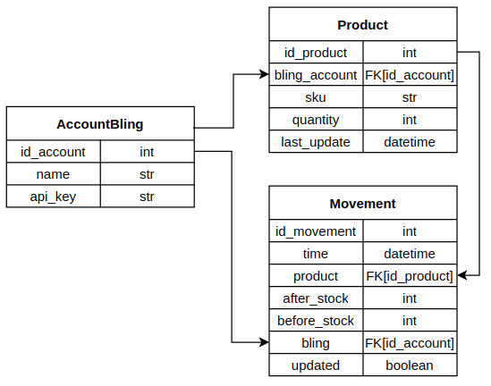

# blingforbling
Application to keep the stock synchronized between 2 Bling accounts.

### Simple Diagram


### BD Diagram


### Disclaimer:
Mandatory requirement that the SKU codes are the same in both accounts. 

## This project was done with:
* Python 3.8.5
* Django 3.0.6
* Requests 2.23.0
* django-braces 1.14.0
* python-decouple 3.4

## How to run project?
* Clone this repository.
* Create virtualenv with Python 3.
* Active the virtualenv.
* Install dependences.
* Run the migrations.
* Create user admin.
```
git clone https://github.com/liviocunha/blingforbling.git
cd blingforbling
python3 -m venv .venv
source .venv/bin/activate
pip3 install -r requirements.txt
python3 manage.py makemigrations core
python3 manage.py migrate
python3 manage.py createsuperuser
python3 manage.py runserver
```
